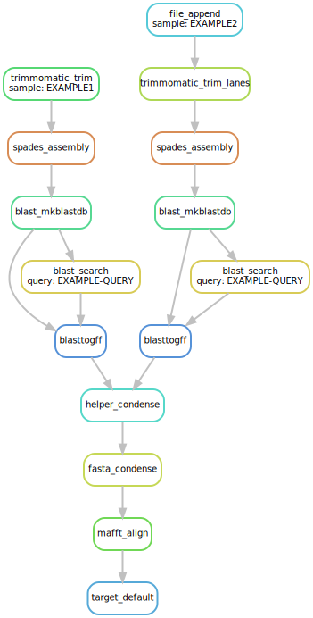
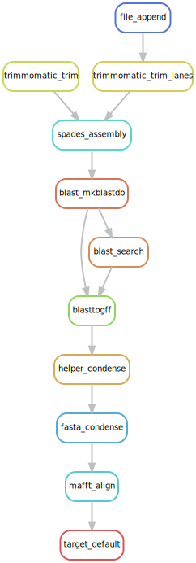

SAHDA: Sequence Alignment from Haplotype De Novo Assembly
================================================

[](https://github.com/JoeBlackSci/genome_assembly_mp1)
[](https://snakemake.readthedocs.io)
[](https://docs.conda.io/projects/conda/en/latest/index.html)


|       **Authors:** | J. Blackwell, M. McDonald |
|-------------------:|:--------------------------|
| **Creation Date:** | 25-02-2020                |
|       **License:** | [ Creative Commons Attribution-NonCommercial 4.0 International License](https://creativecommons.org/licenses/by-nc/4.0/)|
|       **Contact:** | j.blackwell@warwick.ac.uk |

<br>

> **Overview:** Workflow tool designed identify and analyse genes of interest within small haplotype genomes. The workflow will assemble haploid genomes *de novo* from short paired-end reads, create a local BLAST database and query genes of interest. Where genes of interest are detected, a multiple alignment is performed for each gene.

## Contents
1. Method
    1. Inputs
    1. Steps
    1. Outputs
1. Example Workflow
2. File Structure
3. Tutorial
    1. Required Software
        1. Miniconda3
        1. Mamba
        1. Snakemake
    1. Input Data
        1. Paired-end Reads
        1. Adapters fasta file
        1. Target Genes fasta file
    1. Running the Workflow
        1. Setup
        1. Executing the Workflow
        1. Specifying Target Files
        1. Parameters
4. Rules List

## Method

### Inputs
1. Short-read paired end fastq files.
1. Adapter fasta file.
1. Query gene fasta files.

### Outputs
1. Trimmed fastq files.
1. Sample denovo genome assembly.
1. Local genome blast database.
1. Extracted BLAST hits for query genes.
1. Multiple alignment between samples for query genes.

### Steps in Workflow
1. Trimming of raw fastq files \[[trimmomatic](http://www.usadellab.org/cms/?page=trimmomatic)\]
    1. Requires Inputs 1 and 2 
    2. Creates Output 1 
3. Quality control [Not yet implemented]
4. Denovo assembly \[[SPAdes](https://cab.spbu.ru/software/spades/)\]
    1. Output 1 is automatically input into this step
    2. Output 2, contigs.fasta is created in Spades output folder 
5. Create local BLAST databases for each de novo assembly \[[BLAST+](https://www.ncbi.nlm.nih.gov/books/NBK279690/)\]
    1. Output 2 is automatically used as input for this step
    2. Creates Output 3 
6. Query each assembly BLAST databse with gene of interest \[[BLAST+](https://www.ncbi.nlm.nih.gov/books/NBK279690/)\]
    1. Requires Input 3
    2. Uses Input 3 and Output 3 to BLAST gene of interest
7. Extract sequence from the database \[[BLASTtoGFF](https://doi.org/10.1016/j.fgb.2015.04.012)\]
    1. Parses BLAST output file with custom Python script called BLASTtoGFF.py
    2. Creates Output 4 in fasta format
8. Perform multiple alignment for each identified gene \[[MAFFT](https://mafft.cbrc.jp/alignment/software/)\]
    1. Takes Output 4 results from all isolates and creates multiple sequence alignment

> For a full list of Snakemake rules and directed graph of workflow, see the Rules List section. 

## Example Workflow

Included in this repository is a simplified set of example data that is analysed according to the directed acyclic graph shown below. This example includes two isolates, one isolate was sequenced on a single lane, the other isolate was sequenced accross two lanes. As input, there are two reduced sets of paired-end sequences (one of which is split over multiple lanes), an example adapter file and an example gene query.



## File Structure
After running the workflow to completeion you should expect to see the folowing file structure. If you plan on using an intermediate file such as an assembled genome as an input, run the example workflow once to generate the full file structure. 

```
genome_assembly_mp1
├── README.md         # Workflow users guide
├── config            # Config file for customising the workflow
├── images            # Images for the README.md document  
├── logs              # Lists of errors and standard output from the workflow
├── resources         
│   ├── adapters      # Adapter files
│   ├── query         # Query sequences
│   └── reads         # Sequencing libraries
├── results           
│   ├── 00_append     # Appended multi-lane libraries
│   ├── 01_trim       # Trimmed libraries
│   ├── 02_assemble   # Assembled Genomes 
│   ├── 03_blastdb    # Indexed Blast databases of assemblies 
│   ├── 04_search     # BLAST search results
│   ├── 05_retrieve   # Retreived sequences of BLAST hits
│   ├── 07_combine    # Combined retreived sequences 
│   └── 08_align      # Multiple sequence alignments
└── workflow
    ├── envs          # Specifications for software downloads
    └── scripts       # Custom Python scripts
```

## Usage

### Download this Repository
> You can download this entire repository as a zip folder (clone dropdown menu) or by using GIT commands (if you know what those are).

### Install Required Software
> This workflow requires the installation of miniconda3 and snakemake. It is recommended that mamba is also installed. The workflow will then utilise conda to manage any additional software requirements.

These are the methods, as recommended by the [snakemake documentation](https://snakemake.readthedocs.io/en/stable/getting_started/installation.html) for installing the software required for this workflow.

#### Miniconda3
Follow the [miniconda3 installation instructions](https://conda.io/projects/conda/en/latest/user-guide/install/index.html). This will install the latest version of the [Conda](https://conda.io/en/latest/index.html) package, environment management software and it's minimal dependancies.

- Install **miniconda3** and not miniconda2

- Answer **YES** when asked if conda should be put into and manage your **PATH**

>  Install the lastest version of conda, however, if any issues are encountered revert to conda version 4.9.2 used to build this workflow. Conda can manage it's own installation version.


#### Mamba
Conda is python based and can sometimes run slow or select older software versions. [mamba](https://github.com/mamba-org/mamba) is a c++ replacement for conda's package management capabilities. Install mamba using conda via the commandline.
```
conda install -c conda-forge mamba
```
> Again, install the lastest version. If issues are encountered this workflow was created using mamba v0.7.8

#### Snakemake
[Snakemake](https://snakemake.readthedocs.io/en/stable/index.html) is a python based workflow management language for reproducible and scalable data analysis. It is recommended to recreate the snakemake environment used to develop this workflow.

To do so, navigate using the commandline, to the top level of the workflow directory (containing this README.md file). Use the following command, subsituting the file path with your own.
```
cd <path>/<to>/genome_assembly_mp1/
```

Recreate the snakemake environment from the environment.yml `"env_snakemake_mgw.yml"` file in the config folder.
```
mamba env create -f ./config/env_snakemake_mgw.yml
```

Activate the recreated snakemake environment.
```
conda activate env_snakemake_mgw
```

> In order to return to the base conda environment input the following command. But be sure to re-activate the env_snakemake_mgw before runnnig the workflow.
> ```
> conda activate base
> ```

### Input data

#### Paired end reads
Paired end files should be added to the `resources/reads` directory, and the sample name added to the config file described later.

This workflow will accept paired-end short read sequences with filenames of the following formats.
```
<sample_name>_<R1/R2>.fastq.gz
<sample_name>_<lane_no>_<R1/R2>.fastq.gz
```
##### Example filenames
```
SRRXXXXXXX_R1.fastq.gz
AAAXXXX_L001_R1.fastq.gz
```

> Note: The workflow only supports samples spread over two lanes. i.e. only L001 and L002 are currently supported.

#### Adapters
The adapter file, in `.fasta` format, should be added to the `resources/adapters` file and the full filename specified in the `config/config.yml` file.

#### Target gene database
Query genes should be added as individual `.fasta` files to the `resources/query` folder with the format `<gene_query>.fasta`.

### Configuration
The workflow configuration file `config/config.yml` can be edited to specify parameters for the workflow. Including samples, query genes and trimming options.

> Sample names can contain additional underscores, so long are present before `_L00X_RX.fastq.gz` or `_RX.fastq.gz` and are specified in the config.

### Running the Workflow
#### Setup
To run the workflow, navigate using the commandline to the top level directory (containing this README.md file). 
```bash
cd /path/to/genome_assembly_mp1/
```

Activate the workflow's snakemake environment.
```bash
conda activate env_snakemake_mgw
```

> If the snakemake enviroment cannot be activated, ensure that the environment was initially created during initialisation with the `mamba env create -f ./config/env_snakemake_mgw.yml` command.

Add the data required for the analysis to the appropriate resources folders.

Edit the config.yml file to specify the names of samples and query genes.

> Sample names can contain additional underscores, so long are present before `_L00X_RX.fastq.gz` or `_RX.fastq.gz` and are specified in the config.

#### Executing the Workflow
To execute the default workflow run the following command.
```
snakemake --cores all --use-conda
```
> Note this will use the maximum cores available on your local machine. To specify the number of cores use `--cores N` where N is the maximum number of cores to be assigned.

Snakemake will automatically determine which jobs need to be run to generate all target files. Meaning that output files that are already present will not be regenerated.


#### Specifying Target Files
To specify a specific set of output files, follow the snakemake command with a target rule to specify what steps to perform. For example:

```
snakemake --cores all --use-conda target_trim
```

The following is the list of target rules:
```
target_trim       # Trim fastq files
target_assemble   # Assemble denovo genome
target_blastdb    # Create local blast database
target_search     # Search local database for gene query
target_retrieve   # Retrieve identified hit sequences
target_condense   # Combine retrieved sequence files
target_align      # Align retrieved sequences
```

#### Parameters
For a full list of snakemake parameters see the [snakemake documentation](https://snakemake.readthedocs.io/en/stable/executing/cli.html).

[`--use-conda`] **Required** This workflow should always be run with with `--use-conda` flag to enable each rule to download and utilise a specific conda environment. This ensures a reproducible workflow, but also ensures that required software will not conflict.

[`-j --jobs --cores`] **Required** Specify the maximum number of CPU cores to use in parallel. Specify `all` to use all cores available.

[`-n --dryrun`] Dry run the `Snakefile` with `-n` prior to performing an analysis to check for potential errors.

[`-p --printshellcmds`] Print the shell commands to be executed to the terminal.

[`-r --reason`] Print snakemake's reason for executing each job.

[`-R --forcerun`] List the rules that should be re-run. Snakemake does not re-perform analysis if new files are added prior to a step that combines outputs from previous steps. For example if new data has been introduced prior to a multiple alignment. In these instances `-R mafft-align` would need to be specified. A full list of snakemake rules can be seen in the Rules List.

`--list-input-changes` gives a list of output files that are affected by the inclusion of new data. This can be used to automatically trigger a `--forceun` with the following code.

```
snakemake -cores all --forcerun $(snakemake --list-input-changes) --use-conda
```

### Rules List



```
file_append             #00  Append .fasta.gz files split over multiple lanes
trimmomatic_trim        #01a Trim .fasta.gz files
trimmomatic_trim_lanes  #01b Variant rule to trim appended files
spades_assembly         #02  Construct contig assembly
blast_mkblastdb         #03  Make BLAST database for sample assembly
blast_search            #04  Search BLAST database for query gene
blasttogff              #05  Retrieve identified BLAST sequences
helper_condense         #06  (temp dir) Helper rule to specify which files to condense.
fasta_condense          #07  Concatenate retrieved sequences from samples for each query
mafft_align             #08  Align retrieved sequences for each query
```
